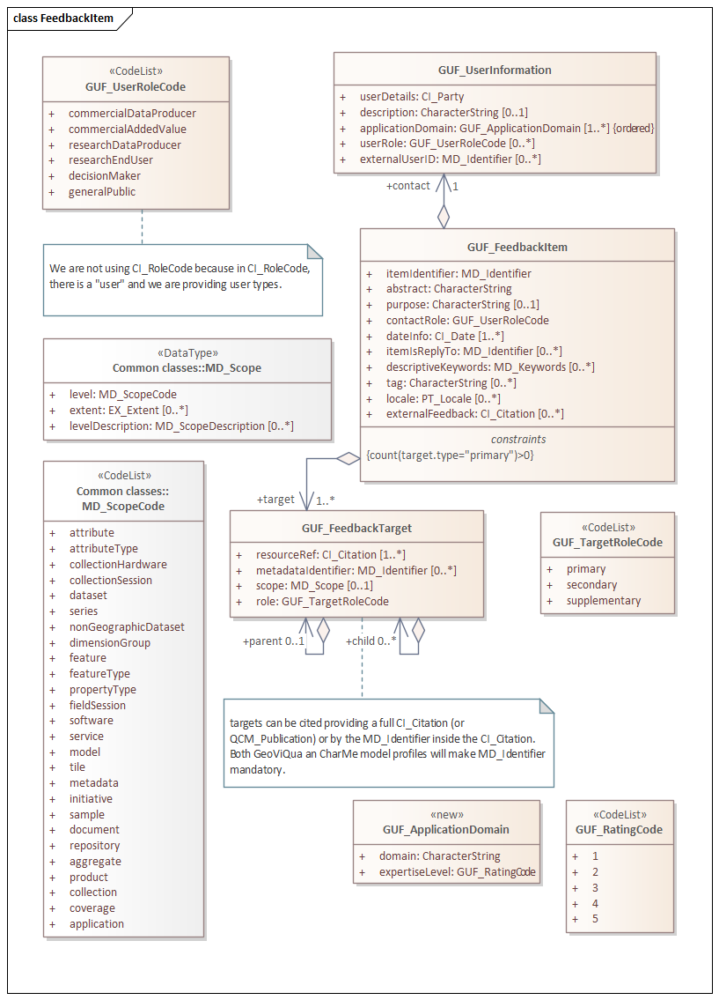
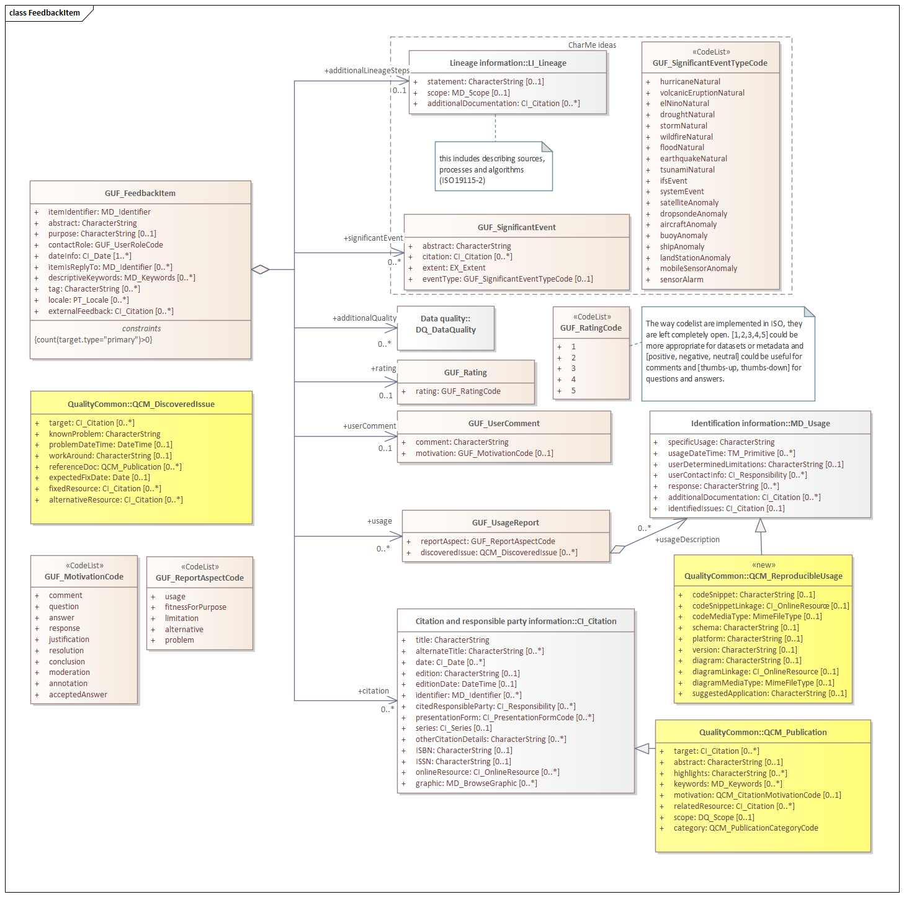

[[sc_user_feedback_item]]
== Requirements Class "User Feedback Item"

=== Overview

This requirements class defines the data model classes that are involved in the definition of an individual user feedback item. A feedback item is the container of the actual feedback. Every item is set into a context by a combination of target, citations and scope.

include::../requirements/requirements_class_user_feedback_item.adoc[]

=== Feedback Item

[#img_feedback_item_1,reftext='{figure-caption} {counter:figure-num}']
.GUF_FeedbackItem (fragment), GUF_UserInformation and GUF_FeedbackTarget in UML

[#img_feedback_item_2,reftext='{figure-caption} {counter:figure-num}']
.GUF_FeedbackItem (fragment), description in UML

[#tbl_feedback_item,reftext='{table-caption} {counter:table-num}']
.GUF_FeedbackItem data type
[width = "100%",options="header"]
|===
|*Name* | *Definition*	| *Data type and values* | *Multiplicity and use*
|itemIdentifier | Identifier for the feedback item. | MD_Identifier data type (ISO 19115-1:2014 B.3.3.3) |  One (mandatory)
|abstract | Brief narrative description of this item, normally for display to a human. | Character String type, not empty |  One (mandatory)
|purpose | Summary of the intentions with which the feedback was provided | Character String type, not empty |  Zero or one (optional)
|contact | Information about the user providing feedback | GUF_UserInformation data type (see Table 8) |  One (mandatory)
|contactRole | User's role in the context of this feedback item. A user may have several roles recorded in the GUF_UserInformation, but this is the one that applies for this feedback ^a^. | GUF_UserRoleCode (see Table 10) |  One (mandatory)
|dateInfo | Date when the feedback item was created, updated etc. | CI_Date (ISO 19115-1:2014 B.3.2.6) |  One or more (mandatory)
|itemIsReplyTo | Identifiers of one or more items of feedback to which this item is a response.  | MD_Identifier data type (ISO 19115-1:2014 B.3.3.3) |  Zero or more (optional). Populate only if the feedback item is responding to another feedback item (e.g. an answer to a previous comment). 
|descriptiveKeywords | Keywords that can be useful to search for this item. They are selected from controlled vocabularies | MD_Keywords data type (ISO 19115-1:2014 B.2.3.2) |  Zero or more (optional)
|tag | Free text word that can be useful to search for this item. | Character String type, not empty |  Zero or more (optional))
|locale | Language and character set used within the feedback item | PT_Locale data type (ISO 19115-1:2014 B.3.4.3) |  Zero or more (optional)
|externalFeedback | Link to an item in an external repository that contains the feedback (not described inline). | CI_Citation data type (ISO 19115-1:2014 B.3.2.1) |  Zero or one (optional) ^b^
|additionalQuality | Structured quality assessment result | DQ_DataQuality data type (ISO 19157:2013 C.2.1.1) |  Zero or more (optional) ^b^
|userComment | Text free user comment | GUF_UserComment data type (see Table 13) | Zero or one (optional) ^b^
|usage | Structured usage report | GUF_UsageReport (see Table 15) |  Zero or more (optional) ^b^
|rating | Rating code reflecting the satisfaction of the user with the resource used | GUF_Rating (see Table 17) |  Zero or one (optional) ^b^
|citation | Citation of a published resource (e.g.: a report, a peer reviewed paper) that provides an evaluation of the usage of the resource | CI_Citation data type (ISO 19115-1:2014 B.3.2.1) or, preferably, QCM_Publication data type (see Table 2)|  Zero or more (optional) ^b^
|{set:cellbgcolor:#D6EAF8}additionalLineageSteps | Additional lineage steps not included in the producer metadata | LI_Lineage data type (ISO 19115-1:2014 B.2.5) |  Zero or one (optional) ^b^
|{set:cellbgcolor:#D6EAF8/}significantEvent | Significant natural events or sensor or platform anomalies that can affect the interpretation of the data. | GUF_SignificantEvent (see Table 18) |  Zero or more (optional) ^b^
|target | Identifies a pre-existing resource (e.g., a dataset or a metadata record) from a catalogue. | GUF_FeedbackTarget (see Table 11)|  One or more (mandatory)
4+| ^a^ The idea is for a single user to be able to embody more than one role, but only one in each item. Thus, a data producer employee may comment and normally speak freely as an end user, but may, for example, issue a metadata override on behalf of the data provider if s/he explicitly chooses that role. S/he would only be allowed to choose roles from his/her user information, and maybe there could be additional restrictions. So users seeking reliable but "semi-official" metadata could look for overrides issued by the provider in that role. +
^b^ 	If none of these elements are populated, the item does not provide feedback and should be considered empty.
|===

[#tbl_user_information_dt,reftext='{table-caption} {counter:table-num}']
.GUF_UserInformation data type
[width = "100%",options="header"]
|===	
|*Name* | *Definition*	| *Data type and values* | *Multiplicity and use*
|{set:cellbgcolor:#D6EAF8}userDetails | Contact details about the user and its organization| CI_Party data type (ISO 19115-1:2014 B.3.2.3)| One (mandatory)
|{set:cellbgcolor:#D5F5E3}description | User short description or bio | Character string, not empty | Zero or one (optional)
|{set:cellbgcolor:#D6EAF8}applicationDomain |Application domain(s) a user works in | GUF_ApplicationDomain element |One or more (mandatory)
|{set:cellbgcolor:#D6EAF8/}userRole |The roles the user can play |GUF_UserRoleCode code list (see Table 10) |Zero or more (optional)
| externalUserID| User ID in an external system such as an ORCID| MD_Identifier data type (ISO 19115-1:2014 B.3.3.3)| Zero or more (optional)
|===	

[#tbl_application_domain_dt,reftext='{table-caption} {counter:table-num}']
.GUF_ApplicationDomain data type
[width = "100%",options="header"]
|===
|*Name* | *Definition*	| *Data type and values* | *Multiplicity and use*
|{set:cellbgcolor:#D5F5E3}domain|An application domain a user works in| Character string, not empty| One (mandatory)
|expertiseLevel|User's expertise level in this particular application domain, restricted by a codelist|GUF_RatingCode (see Table 20)| One (mandatory)
|===
{set:cellbgcolor:#D5F5E3/}

[#tbl_user_role_code_cl,reftext='{table-caption} {counter:table-num}']
.GUF_UserRoleCode code list
[width = "100%",options="header"]
|===	
|*Name* | *Definition*
|commercialDataProducer | Commercial Data Producer
|commercialAddedValue | Commercial Added Value
|researchDataProducer | Scientific Data Producer
|researchEndUser | Research End User
|decisionMaker | Decision Maker
|generalPublic | General Public
|===	

[#tbl_feedback_target_dt,reftext='{table-caption} {counter:table-num}']
.GUF_FeedbackTarget data type
[width = "100%",options="header"]
|===	
|*Name* | *Definition*	| *Data type and values* | *Multiplicity and use*
|resourceRef ^a^ | Reference to a resource (e.g. a dataset or metadata record) that is target of the feedback item or a superset of it ^b^ |CI_Citation data type (ISO 19115-1:2014 B.3.2.1) | One or more (mandatory) ^c^
|metadataIdentifier ^f^ |Identifier for a metadata record about the resource |MD_Identifier data type (ISO 19115-1:2014 B.3.3.3) |Zero or more (optional)
|scope |Describes a type of resource the feedback is about; typically a dataset, a metadata record, a feature... or a subsets of a dataset or resource. |MD_scope data type (ISO 19115-1:2014 B.3.3.1) |Zero or one (optional) ^b^
|role |The role of the target with respect to the feedback item ^g^ |GUF_TargetRoleCode code (see Table 12) | One (mandatory)
|parent |Parent of the cited resource ^d^ |GUF_FeedbackTarget data type (see this table) |Zero or one (optional) 
|child |Child of the cited resource ^e^ |GUF_FeedbackTarget data type (see this table) |Zero or more (optional)
4+| ^a^	Do not confuse this data type with itemIsReplyTo in GUF_FeedbackItem. In the case where a feedback item replies to another feedback item, this is indicated in itemIsReplyTo. It is expected that the targets of both items are identical including the same resourceRef. +
^b^	If the reference cites a superset of the feedback target, use ‘scope’ to define the right subset of the resource referenced. +
^c^	If more than one is provided they shall point to the same resource. If you have more than one resource, use more than one GUF_FeedbackTarget elements. +
^d^	This may be used to present feedback to users grouped by the parent resources: for example, a user evaluating the quality of a single remotely-sensed image tile may also wish to see feedback on the global set of tiles, or all feedback relating to the entire data collection campaign. +
^e^	If the target is a collection, this can be used to mention its members. +
^f^ If the resource is a metadata record, this element should not be populated; use resourceRef/citation/identifier instead. +
^g^ Corrigenda: in GUF v.1 Conceptual model documentation the role attribute appeared as "targetType". Not in the UML models and XSD schemas, where "role" attribute was correctly documented.
|===	

[#tbl_target_role_code_cl,reftext='{table-caption} {counter:table-num}']
.GUF_TargetRoleCode code list
[width = "100%",options="header"]
|===	
|*Name* | *Definition*
|primary | Identifies a pre-existing resource that is the subject of the feedback item, i.e. points to the resources the feedback is about.
|secondary | Referenced resources, implying that the feedback item might be relevant to the referenced resource.
|supplementary | Identifiers to additional references, e.g., another region in another dataset with similar problems. It is used to formally model references that somehow are related to the feedback item at hand, but does not imply that the feedback is relevant for the referenced subject. (An exemplary resource reference should be of this code; such feedback would not typically be shown with the resource).
|===	

[#tbl_user_comment_dt,reftext='{table-caption} {counter:table-num}']
.GUF_UserComment data type
[width = "100%",options="header"]
|===
|*Name* | *Definition*	| *Data type and values* | *Multiplicity and use*
|comment |Free text |Character String type, not empty |One (mandatory)
|motivation |Motivation of the comment: it can be a comment, a question, an answer or a justification (e.g. a justification for a rating) |GUF_MotivationCode code list (see Table 14) | Zero or one (optional)
|===

[#tbl_motivation_code_cl,reftext='{table-caption} {counter:table-num}']
.GUF_MotivationCode code list
[width = "100%",options="header"]
|===	
|*Name* | *Definition*
|comment|Isolated comment or a part of a discussion (a sequence of interrelated comments) 
|question |Question about a feedback target that awaits an answer 
|answer |Answer (possibly one of several, possibly incorrect) to a previous “question” formulated in a previous feedback item (use itemIsReplyTo to refer to a previous question or comment) 
|acceptedAnswer|The answer that has been accepted as best to a previous question formulated in a previous feedback item (use itemIsReplyTo to refer to a previous question or comment) 
|response|Response or a reaction of the producer or other responsible party to another feedback item (e.g: a “comment” or a “discovered issue” of a usage problem) (use itemIsReplyTo to refer to the item that motivated the response) 
|justification | Justification or explanation clarifying the reasoning in another part of the feedback item e.g.: a rating 
|resolution|Resolution declaring a discussion thread (a sequence of interrelated questions, answers and comments) closed (use itemIsReplyTo to refer to the last question, answer or comment)
|moderation |Reason why another feedback item has been moderated or censored 
|annotation | Tag on a feature present in the data that incorporate information that can be later useful for others
|conclusion | The final or summary nature of a particular comment
|===	

[#tbl_usage_report_dt,reftext='{table-caption} {counter:table-num}']
.GUF_UsageReport data type
[width = "100%",options="header"]
|===
|*Name* | *Definition*	| *Data type and values* | *Multiplicity and use*
//[width="90%",options="header",float="center"]
|reportAspect| Aspect reported|GUF_ReportAspectCode code list (see Table 16) |One (mandatory)
|usageDescription |Usage description or limitation of the target |MD_Usage code list (ISO 19115-1:2014 B.2.3.6) |Zero or more (optional)
|discoveredIssue | Discovered issue in the target resource| QCM_DiscoveredIssue data type (see Table 5)| Zero or more (optional)
|===

[#tbl_report_aspect_code_cl,reftext='{table-caption} {counter:table-num}']
.GUF_ReportAspectCode code list
[width = "100%",options="header"]
|===	
|*Name* | *Definition*
//[width="90%",options="header",float="center"]
|usage |Description of a usage of the target resource. At least one MD_Usage should be populated 
|fitnessForPurpose |Description of a usage of the target resource that was appropriated for the intended purpose. At least one MD_Usage should be populated 
|limitation |Description of a limitation of the target resource. At least one userDeterminedLimitations in MD_Usage should be populated 
|alternative |Alternative route that helps to avoid a problem or a limitation. At least workAround or alternativeResource in one QCM_DiscoveredIssue should be populated 
|problem |A report of a problem or an issue. At least one QCM_DiscoveredIssue should be populated |
|===	

[#tbl_rating_dt,reftext='{table-caption} {counter:table-num}']
.GUF_Rating data type
[width = "100%",options="header"]
|===
|*Names* | *Definition*	| *Data type and values* | *Multiplicity and use*
//[width="90%",options="header",float="center"]
| rating| Rating in the form of a simple numeric code that qualifies subjectively the feedback target| GUF_RatingCode (see Table 20), GUF_ThumbsCode (see Table 21), GUF_SignCode (see Table 22) or other numerical code for rating| One (mandatory)
|===

[#tbl_significant_event_dt,reftext='{table-caption} {counter:table-num}']
.GUF_SignificantEvent data type
[width = "100%",options="header"]
|===
|*Names* | *Definition*	| *Data type and values* | *Multiplicity and use*
//[width="90%",options="header",float="center"]
|abstract |Brief narrative description of this event, normally for display to a human. |Character String type, not empty |One (mandatory)
|citation |Citation of the event (e.g.: a report describing the event, or a event identifier) |CI_Citation data type (ISO 19115-1:2014 B.3.2.1) |Zero or more (optional)
|extent |Spatio-temporal extent of the event |EX_Extent data type (ISO 19115-1:2014 B.3.1.1) |One (mandatory)
|eventType |Type of event |GUF_SignificantEventTypeCode (see Table 19) |Zero or one (optional)
|===

[#tbl_significant_event_TypeCode_cl,reftext='{table-caption} {counter:table-num}']
.GUF_SignificantEventTypeCode code list
[width = "100%",options="header"]
|===
|*Names* | *Definition*	
//[width="90%",options="header",float="center"]
|hurricaneNatural |Hurricane episode
|volcanicEruptionNatural |Volcanic Eruption episode
|elNinoNatural |El Nino natural event 
|droughtNatural |Remarkable drought episode
|stormNatural |Remarkable Storm natural event
|wildfireNatural |Remarkable Wildfire natural event
|floodNatural |Remarkable Flood natural event
|earthquakeNatural |Remarkable Earthquake natural event
|tsunamiNatural |Remarkable Tsunami natural event
|ifsEvent |Integrated Forecast System event (e.g. a problem)
|systemEvent |Acquisition or distribution system event (e.g. a problem etc)
|satelliteAnomaly |Abnormal data in a satellite system (e.g. a sensor glitch)
|dropsondeAnomaly |Abnormal data from a dropsonde
|aircraftAnomaly |Abnormal data from a airborne system (e.g. a sensor glitch)
|buoyAnomaly |Abnormal data from a buoy
|shipAnomaly |Abnormal data from a ship sensing system (e.g. a sensor glitch)
|landStationAnomaly |Abnormal data from a land station (e.g. a sensor glitch)
|mobileSensorAnomaly |Abnormal data from a mobile sensor anomaly (e.g. a sensor glitch)
|sensorAlarm |Abnormal acquisition above or below normal parameters.
|===

NOTE: This codelist is based on the CHARMe project, which focused primarily on hazards and climatic analysis. (https://software.ecmwf.int/wiki/display/CHAR/Significant+Events). Here, as in other parts of the data model, the codelist approach allows further domain-specific entities to be described and modeled.

=== *Numeric Codelist for rating*

A numeric is a codelist that has a correspondence to a numeric code. This allows for item sorting and numerical calculations such as totals and averages based on the numeric code. Table 20, Table 21 and Table 22 are examples of numeric codelists that can be used for rating.

GUF_RatingCode is intended for implementing a 5 star rating system. This can be used for target resources or for user expertiseLevel. E.g. this is currently used in amazon.com and many other websites.

[#tbl_significant_event_TypeCode_cl,reftext='{table-caption} {counter:table-num}']
.GUF_SignificantEventTypeCode code list
[width = "100%",options="header"]
[.text-center]
*Table 20 — GUF_RatingCode numeric code type*
|===
|*Number* |*Code* |*Definition*
//[width="90%",options="header",float="center"]
|1 |oneStar | Very bad 
|2 |twoStars | Bad
|3 |threeStars | Regular
|4 |fourStars | Good
|5 |fiveStars | Excellent
|===

GUF_ThumbsCode is intended for implementing an “I like” system. GUF_ThumbsCode is expected to be used to give feedback on another feedback item, e.g. to rate the comment of another user about a target resource. E.g. this is currently used in facebook.com “I like” and many other websites.

[#tbl_thumbs_code_nc,reftext='{table-caption} {counter:table-num}']
.GUF_ThumbsCode numeric code type
[width = "100%",options="header"]
|===
|*Number* |*Code* |*Definition*
//[width="90%",options="header",float="center"]
|-1 |thumbsDown |Thumbs down
|1 |thumbsUp |Thumbs up
|===

GUF_SignCode could be used to accompany textual GUF_UserComment to give an indication if the comment is emphasizing a positive aspect, a neutral or a negative aspect (e.g. a complaint). E.g. this is currently used to rate user reputation in ebay.com.

[#tbl_sign_code_nc,reftext='{table-caption} {counter:table-num}']
.GUF_SignCode numeric code type
[width = "100%",options="header"]
|===
|*Number* |*Code* |*Definition*
//[width="90%",options="header",float="center"]
|-1 |negative |Negative
|0 |neutral |Neutral
|1 |positive |Positive
|===